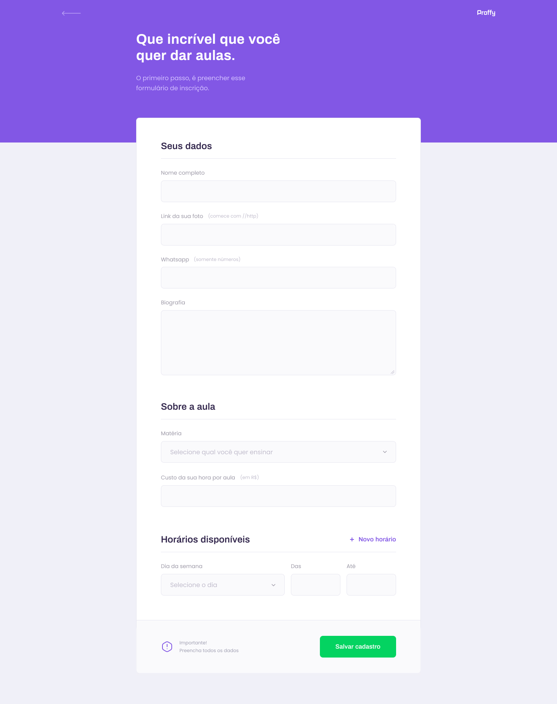

### Plataforma de estudos online, afim de possibilitar uma conexão entre alunos com professores.

---

## 📋 Índice

- [Sobre](#-Sobre)
- [Tecnologias utilizadas](#-Tecnologias-utilizadas)
- [Como executar o projeto](#-Como-executar-o-projeto)
- [Preview](#-Preview)
---

## 📖 Sobre 

Este é um projeto desenvolvido durante a **[Next Level Week](https://nextlevelweek.com/)**, realizada pela **[@Rocketseat](https://github.com/Rocketseat)** durante os dias 3 a 9 de Agosto de 2020.

A proposta do projeto é uma aplicação que possa ligar quem deseja aprender, com quem quer ensinar. É possível encontrar alunos para o que você leciona, ou encontrar o professor para aquela matéria que você sempre quis aprender mais! Sem que haja nenhuma limitação de área!

--- 

## 🚀 Tecnologias utilizadas

O projeto foi desenvolvido na trilha Discovery utilizando as seguintes tecnologias:

### Front-End

- HTML
- CSS
- JavaScript

### Back-End

- Node.js 
- Nunjucks 
- SQLite 

--- 
## 🖥 Preview 

 

---

<table>
  <tr>
    <td>Coded By</td><td>Instrutor</td>
  </tr>
  <tr>
    <td>
      
    </td>
    <td>
      
    </td>
  </tr>
</table>

